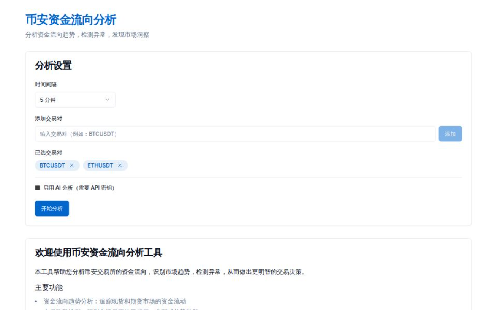

# Flow Track Crypto

A modern web application for tracking and analyzing funding flows on Binance cryptocurrency markets. This tool helps traders and analysts identify market trends, detect anomalies, and make more informed trading decisions.

## Features

- **Funding Flow Trend Analysis**: Track capital movement in spot and futures markets
- **Market Stage Detection**: Identify whether markets are in accumulation, distribution, or trending phases
- **Anomaly Detection**: Spot unusual trading activity that may signal price movements
- **Order Book Analysis**: Analyze buying and selling pressure
- **Cross-Market Comparison**: Compare spot vs futures markets to identify divergences
- **Multi-Timeframe Support**: Analyze data across various timeframes (5m, 15m, 30m, 1h, 4h, 1d)

## Live Demo

The application is deployed on Vercel and can be accessed at [https://flow-track-crypto.vercel.app](https://flow-track-crypto.vercel.app)

## Screenshots



## Technology Stack

- **Frontend Framework**: Next.js 14 with App Router
- **Language**: TypeScript
- **Styling**: Tailwind CSS
- **UI Components**: Shadcn UI
- **API Integration**: Direct Binance API calls from the client
- **Charts**: Recharts
- **Deployment**: Vercel

## Getting Started

### Prerequisites

- Node.js 18.x or higher
- npm or yarn

### Installation

1. Clone the repository
```bash
git clone https://github.com/yourusername/flow-track-crypto.git
cd flow-track-crypto
```

2. Install dependencies
```bash
npm install
# or
yarn install
```

3. Start the development server
```bash
npm run dev
# or
yarn dev
```

4. Open [http://localhost:3000](http://localhost:3000) in your browser to see the application

### Building for Production

```bash
npm run build
# or
yarn build
```

## How It Works

The application directly fetches data from Binance's public API endpoints:

1. **Kline (Candlestick) Data**: Retrieves historical price and volume data for both spot and futures markets
2. **Order Book Data**: Analyzes the current buy and sell orders to calculate market pressure
3. **Analysis Algorithms**: Processes the raw data to detect trends, anomalies, and market stages
4. **User Interface**: Presents the analyzed data in an intuitive, interactive interface

## Architecture

The application follows a clean, modular architecture:

- `/src/app`: Next.js app router pages
- `/src/components`: React components, separated by feature and function
- `/src/lib`: Utility functions, API clients, and analysis algorithms
- `/src/types`: TypeScript type definitions
- `/src/hooks`: Custom React hooks

## API Integration

The application directly communicates with Binance's public API endpoints:

- Spot market: `https://api.binance.com`
- Futures market: `https://fapi.binance.com`

All API requests include retry logic and rate limiting protection to ensure reliability.

## Contributing

Contributions are welcome! Please feel free to submit a Pull Request.

1. Fork the repository
2. Create your feature branch (`git checkout -b feature/amazing-feature`)
3. Commit your changes (`git commit -m 'Add some amazing feature'`)
4. Push to the branch (`git push origin feature/amazing-feature`)
5. Open a Pull Request

## License

This project is licensed under the MIT License - see the LICENSE file for details.

## Acknowledgments

- Binance API for providing the market data
- Shadcn UI for the beautiful UI components
- The Next.js team for the amazing framework
